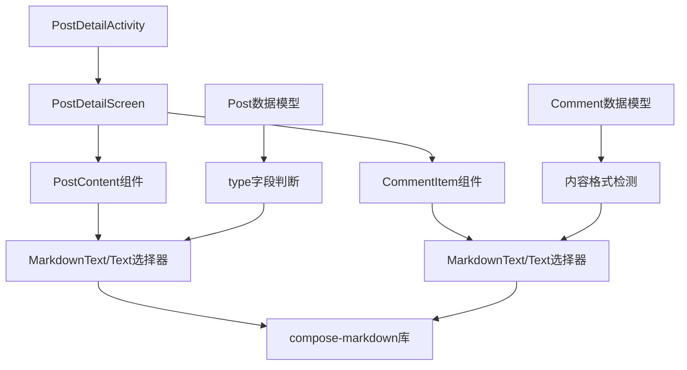
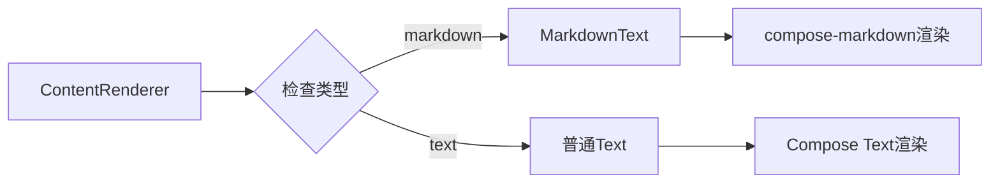
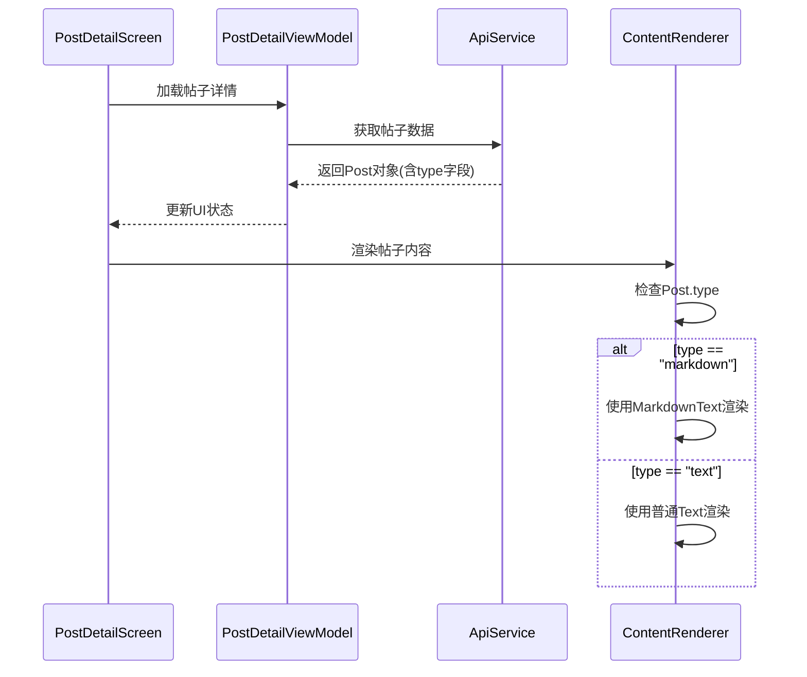

# 帖子详情Markdown支持设计文档

## 概述

本设计文档描述了为Tranx社区应用添加Markdown渲染支持的技术实现方案。通过集成compose-markdown库，实现帖子内容和评论的Markdown格式渲染，同时保持良好的性能和用户体验。

## 技术架构

### 整体架构图



### 核心组件设计

#### 1. 内容渲染组件

创建一个通用的内容渲染组件，根据内容类型选择合适的渲染方式：



#### 2. 数据流设计



## 实现方案

### 1. 依赖集成

在`app/build.gradle.kts`中添加compose-markdown依赖：

```kotlin
dependencies {
    // Markdown渲染库
    implementation("com.github.jeziellago:compose-markdown:0.5.8")
}
```

### 2. 内容渲染组件实现

创建通用的内容渲染组件：

```kotlin
@Composable
fun ContentRenderer(
    content: String,
    contentType: String? = "text",
    style: TextStyle = MaterialTheme.typography.bodyLarge,
    modifier: Modifier = Modifier
) {
    when (contentType) {
        "markdown" -> {
            MarkdownText(
                markdown = content,
                style = style,
                modifier = modifier
            )
        }
        else -> {
            Text(
                text = content,
                style = style,
                modifier = modifier
            )
        }
    }
}
```

### 3. PostContent组件修改

修改现有的PostContent组件以支持Markdown：

```kotlin
@Composable
private fun PostContent(post: Post) {
    Column(
        modifier = Modifier
            .fillMaxWidth()
            .padding(16.dp)
    ) {
        Text(text = post.title, style = MaterialTheme.typography.headlineSmall)
        Spacer(modifier = Modifier.height(12.dp))
        
        // 用户信息和时间显示...
        
        Spacer(modifier = Modifier.height(16.dp))
        
        // 使用新的内容渲染组件
        ContentRenderer(
            content = post.content,
            contentType = post.type,
            style = MaterialTheme.typography.bodyLarge
        )
        
        // 图片显示...
    }
}
```

### 4. CommentItem组件修改

修改评论组件以支持Markdown：

```kotlin
@Composable
private fun CommentItem(
    comment: Comment,
    // 其他参数...
) {
    Card(
        modifier = Modifier
            .fillMaxWidth()
            .padding(horizontal = 16.dp, vertical = 4.dp)
    ) {
        Column(
            modifier = Modifier
                .fillMaxWidth()
                .padding(12.dp)
        ) {
            // 评论头部信息...
            
            Spacer(modifier = Modifier.height(8.dp))
            
            // 评论内容渲染
            ContentRenderer(
                content = comment.content ?: "",
                contentType = "markdown", // 评论默认支持markdown
                style = MaterialTheme.typography.bodyMedium
            )
            
            // 其他UI元素...
        }
    }
}
```

## 性能优化策略

### 1. 渲染优化

- 使用`remember`缓存Markdown渲染结果
- 对长文本进行分页或懒加载
- 避免在滚动时重复渲染

### 2. 内存管理

- 及时释放不需要的Markdown渲染资源
- 使用适当的缓存策略避免重复解析

### 3. 异步处理

- Markdown解析在后台线程进行
- 使用协程处理复杂的渲染任务

## 样式定制

### 1. 主题适配

确保Markdown渲染的样式与应用主题保持一致：

```kotlin
@Composable
fun ThemedMarkdownText(
    markdown: String,
    modifier: Modifier = Modifier
) {
    MarkdownText(
        markdown = markdown,
        style = TextStyle(
            color = MaterialTheme.colorScheme.onSurface,
            fontSize = MaterialTheme.typography.bodyLarge.fontSize
        ),
        modifier = modifier
    )
}
```

### 2. 自定义样式

根据应用设计规范定制Markdown元素的样式。

## 错误处理

### 1. 渲染失败处理

当Markdown渲染失败时，回退到普通文本显示：

```kotlin
@Composable
fun SafeContentRenderer(
    content: String,
    contentType: String?,
    modifier: Modifier = Modifier
) {
    try {
        ContentRenderer(content, contentType, modifier = modifier)
    } catch (e: Exception) {
        // 回退到普通文本
        Text(
            text = content,
            modifier = modifier,
            style = MaterialTheme.typography.bodyLarge
        )
    }
}
```

### 2. 数据验证

在渲染前验证内容格式和类型的有效性。

## 测试策略

### 1. 单元测试

- 测试ContentRenderer组件的不同输入情况
- 验证类型判断逻辑的正确性

### 2. UI测试

- 测试Markdown渲染的视觉效果
- 验证不同主题下的显示效果

### 3. 性能测试

- 测试大量Markdown内容的渲染性能
- 验证滚动流畅度

## 边界情况处理

| 情况 | 处理方式 | 代码位置 |
|------|----------|----------|
| Post.type为null | 默认使用text渲染 | ContentRenderer |
| Post.content为空 | 显示空状态提示 | PostContent |
| Markdown格式错误 | 回退到文本渲染 | SafeContentRenderer |
| 网络图片加载失败 | 显示占位符 | MarkdownText内部 |
| 超长文本内容 | 实现分页或截断 | ContentRenderer |
| 评论content为null | 显示默认提示文本 | CommentItem |